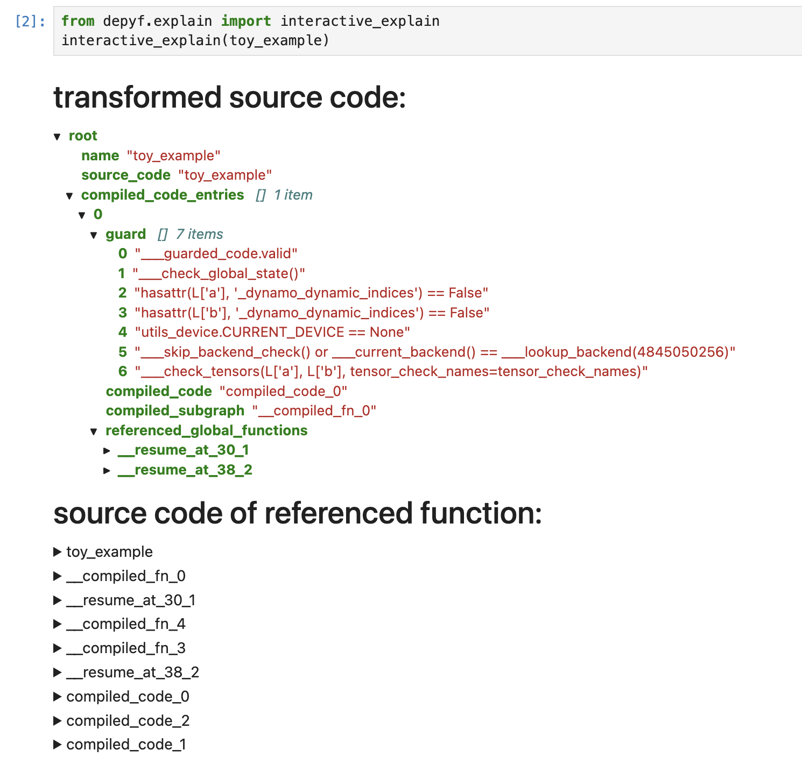

# `torch.compile`, explained!

Have you ever felt overwhelmed by the complexities of `torch.compile`? Diving into its workings can feel like black magic, with bytecode and Python internal details that many users fail to understand, hindering them from understanding and debugging `torch.compile`.

We are excited to announce `depyf`, a new tool to pull out all the artifacts of `torch.compile`, and to decompile all the bytecode into source code so that every user understands it.

# Example usage:

```diff
import torch
+ @torch.compile(backend="eager")
- @torch.compile
def toy_example(a, b):
    x = a / (torch.abs(a) + 1)
    if b.sum() < 0:
        b = b * -1
    return x * b

for _ in range(100):
    toy_example(torch.randn(10), torch.randn(10))

+ from depyf.explain import dump_src
+ src = dump_src(toy_example)
+ with open("explained_code.py", "w") as f:
+     f.write(src)
```

It's this simple: switch the backend to `"eager"`, and run the `dump_src` function to pull out all the artifacts from `torch.compile`.

In the dumped `explained_code.py` file, you can see something like below:

```python

def guard_2(L):
    return (___guarded_code.valid) \
        and (___check_global_state()) \
        and (hasattr(L['b'], '_dynamo_dynamic_indices') == False) \
        and (hasattr(L['x'], '_dynamo_dynamic_indices') == False) \
        and (utils_device.CURRENT_DEVICE == None) \
        and (___skip_backend_check() or ___current_backend() == ___lookup_backend(5096739488)) \
        and (___check_tensors(L['b'], L['x'], tensor_check_names=tensor_check_names))

def __compiled_fn_4(L_b_ : torch.Tensor, L_x_ : torch.Tensor):
      l_b_ = L_b_
      l_x_ = L_x_
      mul = l_x_ * l_b_;  l_x_ = l_b_ = None
      return (mul,)


def compiled_code_2(b, x):
      return __compiled_fn_4(b, x)[0]


def __resume_at_38_2(b, x):
    # Note: if there is a compiled version below, this function might well not be executed directly. Please check the compiled version if possible.
    return x * b

def compiled___resume_at_38_2(b, x):
    L = {"b": b, "x": x}
    if guard_2(L):
        return compiled_code_2(b, x)
    # Note: this function might well not be executed directly. It might well be compiled again, i.e. adding one more guards and compiled code.
    return __resume_at_38_2(b, x)

#============ end of __resume_at_38_2 ============#

def guard_1(L):
    return (___guarded_code.valid) \
        and (___check_global_state()) \
        and (hasattr(L['b'], '_dynamo_dynamic_indices') == False) \
        and (hasattr(L['x'], '_dynamo_dynamic_indices') == False) \
        and (utils_device.CURRENT_DEVICE == None) \
        and (___skip_backend_check() or ___current_backend() == ___lookup_backend(5096739488)) \
        and (___check_tensors(L['b'], L['x'], tensor_check_names=tensor_check_names))

def __compiled_fn_3(L_b_ : torch.Tensor, L_x_ : torch.Tensor):
      l_b_ = L_b_
      l_x_ = L_x_
      b = l_b_ * -1;  l_b_ = None
      mul_1 = l_x_ * b;  l_x_ = b = None
      return (mul_1,)


def compiled_code_1(b, x):
      return __compiled_fn_3(b, x)[0]


def __resume_at_30_1(b, x):
    # Note: if there is a compiled version below, this function might well not be executed directly. Please check the compiled version if possible.
    b = b * -1
    return x * b

def compiled___resume_at_30_1(b, x):
    L = {"b": b, "x": x}
    if guard_1(L):
        return compiled_code_1(b, x)
    # Note: this function might well not be executed directly. It might well be compiled again, i.e. adding one more guards and compiled code.
    return __resume_at_30_1(b, x)

#============ end of __resume_at_30_1 ============#

def guard_0(L):
    return (___guarded_code.valid) \
        and (___check_global_state()) \
        and (hasattr(L['a'], '_dynamo_dynamic_indices') == False) \
        and (hasattr(L['b'], '_dynamo_dynamic_indices') == False) \
        and (utils_device.CURRENT_DEVICE == None) \
        and (___skip_backend_check() or ___current_backend() == ___lookup_backend(5096739488)) \
        and (___check_tensors(L['a'], L['b'], tensor_check_names=tensor_check_names))

def __compiled_fn_0(L_a_ : torch.Tensor, L_b_ : torch.Tensor):
      l_a_ = L_a_
      l_b_ = L_b_
      abs_1 = torch.abs(l_a_)
      add = abs_1 + 1;  abs_1 = None
      x = l_a_ / add;  l_a_ = add = None
      sum_1 = l_b_.sum();  l_b_ = None
      lt = sum_1 < 0;  sum_1 = None
      return (x, lt)


def compiled_code_0(a, b):
      __temp_29 = __compiled_fn_0(a, b)
      x = __temp_29[0]
      if __temp_29[1]:
          return __resume_at_30_1(b, x)
      return __resume_at_38_2(b, x)


def toy_example(a, b):
    # Note: if there is a compiled version below, this function might well not be executed directly. Please check the compiled version if possible.
    x = a / (torch.abs(a) + 1)
    if b.sum() < 0:
        b = b * -1
    return x * b

def compiled_toy_example(a, b):
    L = {"a": a, "b": b}
    if guard_0(L):
        return compiled_code_0(a, b)
    # Note: this function might well not be executed directly. It might well be compiled again, i.e. adding one more guards and compiled code.
    return toy_example(a, b)

#============ end of toy_example ============#
```

You can explore the code with your favorite IDE. Start from the `toy_example` function, and pay attention to the `compiled_toy_example` function below, walk through all the details of guards/compiled code/compiled subgraph/resume functions. It's all in readable source code format!

# Installation

Stable release: `pip install depyf`

Nightly version (recommended): `pip install git+https://github.com/thuml/depyf.git`

# Other usages:

## General Usage:

`depyf` is a general-purpose tool to decompile Python bytecode into source code.

```python
# obtain a callable object or codeobject
def func():
    print("hello, world!")
# import the `decompile` function
from depyf import decompile
# and decompile it into source code!
print(decompile(func))
```

Example output:

```python
def func():
    print('hello, world!')
    return None
```

The output source code is semantically equivalent to the function, but not syntactically the same. It verbosely adds many details that are hidden in the Python code. For example, the above output code explicitly returns `None`, which is typically ignored.

## Interactively explore artifacts of `torch.compile`

Please run the [Jupyter Lab Notebook](https://github.com/thuml/depyf/blob/master/explain_pt2.ipynb).

In the notebook, you can interactively select the content you want to explore. The UI looks like the following:



## Enhance `torch.compile` logging

`depyf` works closely with PyTorch. If you have a PyTorch program with `torch.compile`, you only need to add a single line to enable the decompilation of PyTorch bytecode.

```diff
+ import depyf
+ depyf.install()
from typing import List
import torch
from torch import _dynamo as torchdynamo
def my_compiler(gm: torch.fx.GraphModule, example_inputs: List[torch.Tensor]):
    print("my_compiler() called with FX graph:")
    gm.graph.print_tabular()
    return gm.forward  # return a python callable

@torchdynamo.optimize(my_compiler)
def toy_example(a, b):
    x = a / (torch.abs(a) + 1)
    if b.sum() < 0:
        b = b * -1
    return x * b
for _ in range(100):
    toy_example(torch.randn(10), torch.randn(10))
```

Then, run the code with the environment variable `export TORCH_LOGS="+dynamo,guards,bytecode"` to get verbose logging information. (Or you can `export TORCH_LOGS="+bytecode"` to focus on the bytecode only.)

In the long log output, you can see that decompiled bytecode occurs after the modified bytecode of Dynamo:

```diff
ORIGINAL BYTECODE toy_example /workspace/thuml/code/pytorch/ykc.py line 12 
 14           0 LOAD_FAST                0 (a)
              2 LOAD_GLOBAL              0 (torch)
              4 LOAD_METHOD              1 (abs)
              6 LOAD_FAST                0 (a)
              8 CALL_METHOD              1
             10 LOAD_CONST               1 (1)
             12 BINARY_ADD
             14 BINARY_TRUE_DIVIDE
             16 STORE_FAST               2 (x)

 15          18 LOAD_FAST                1 (b)
             20 LOAD_METHOD              2 (sum)
             22 CALL_METHOD              0
             24 LOAD_CONST               2 (0)
             26 COMPARE_OP               0 (<)
             28 POP_JUMP_IF_FALSE       19 (to 38)

 16          30 LOAD_FAST                1 (b)
             32 LOAD_CONST               3 (-1)
             34 BINARY_MULTIPLY
             36 STORE_FAST               1 (b)

 17     >>   38 LOAD_FAST                2 (x)
             40 LOAD_FAST                1 (b)
             42 BINARY_MULTIPLY
             44 RETURN_VALUE


MODIFIED BYTECODE toy_example /workspace/thuml/code/pytorch/ykc.py line 12 
 12           0 LOAD_GLOBAL              3 (__compiled_fn_0)
              2 LOAD_FAST                0 (a)
              4 LOAD_FAST                1 (b)
              6 CALL_FUNCTION            2
              8 UNPACK_SEQUENCE          2
             10 STORE_FAST               2 (x)
             12 POP_JUMP_IF_FALSE       12 (to 24)
             14 LOAD_GLOBAL              4 (__resume_at_30_1)
             16 LOAD_FAST                1 (b)
             18 LOAD_FAST                2 (x)
             20 CALL_FUNCTION            2
             22 RETURN_VALUE
        >>   24 LOAD_GLOBAL              5 (__resume_at_38_2)
             26 LOAD_FAST                1 (b)
             28 LOAD_FAST                2 (x)
             30 CALL_FUNCTION            2
             32 RETURN_VALUE


+ possible source code:
+ def toy_example(a, b):
+     __temp_1 = __compiled_fn_0(a, b)
+     x = __temp_1[0]
+     if __temp_1[1]:
+         return __resume_at_30_1(b, x)
+     return __resume_at_38_2(b, x)
+ 
+ If you find the decompiled code is wrong,please submit an issue at https://github.com/thuml/depyf/issues.
```

:warning: We recommend running the above examples with PyTorch nightly.

# Python Version Coverage

The following python major versions are tested:

- Python 3.12
- Python 3.11
- Python 3.10
- Python 3.9
- Python 3.8
- Python 3.7

You can see the coverage report by simply running `python python_coverage.py`.

# Full Python Syntax Is Not Supported

This package is intended to understand the generated PyTorch bytecode, and does not aim to fully cover all the syntax of Python. For example, async operations like `async/await` are not supported.

All the bytecode generated by PyTorch when benchmarking timm and huggingface transformers are collected [here](https://github.com/thuml/depyf/tree/master/pytorch_bytecode). We can make several observations:

- No while loops (no jump back instructions).
- try-except-finally only has try-finally.
- No complicated conditions like `if a and b or c or (d and e)`.

Then, we can overfit the decompiler to work for the bytecode generated by PyTorch. How? Pure labor work. Implement all bytecode for all the supported Python versions, one by one. Yes, that's it.

# Contributions are welcome!

If you find any error in the decompilation, feel free to open issues or pull requests to fix it!

Hopefully, by using this package, everyone can understand `torch.compile` now!

# Contact

Any discussion/issue report/PR is welcome. Or contact youkaichao@gmail.com if you have any other problems.
