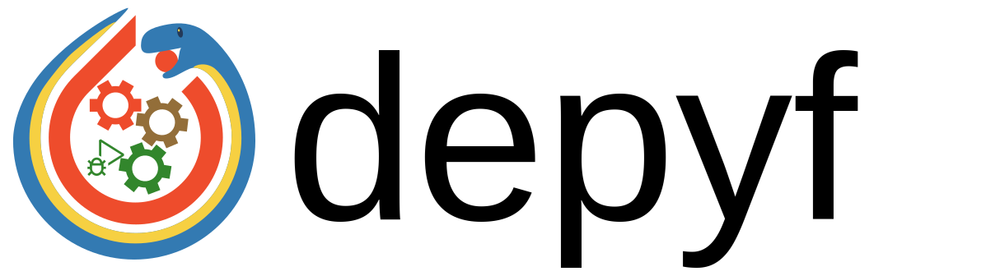

[](https://depyf.readthedocs.io/en/latest/)    

Have you ever felt overwhelmed by the complexities of `torch.compile`? Diving into its workings can feel like black magic, with bytecode and Python internal details that many users fail to understand, hindering them from understanding and adapting to `torch.compile`.

If you also face the problem, then you might be interested in `depyf`. As the logo suggests, `depyf` is a software tool to leverage advanced Python features (the Python snake symbol) to open up internal details (the internal gears symbol) of PyTorch's compiler `torch.compile` (the PyTorch logo), so that users can understand it, adapt to it, and tune their code (the debugger symbol) to get maximum performance benefit out of it.

:warning: This project is developed under close collaborations with the PyTorch team. We frequently require new features from PyTorch to support better understanding of `torch.compile`. Therefore, **please use this project along with PyTorch nightly**. Visit the [PyTorch website](https://pytorch.org/) for how to install nightly version of PyTorch. **We recommend updating your PyTorch nightly installation every week or so**.

:warning: During development, we seek suggestions from the community quite a lot. You may find some early usage examples from some discussion forums or social media platforms. **Please follow the latest documentation for how to use this tool.**

# Why `depyf`?

If you want to understand bytecode generated by `torch.compile`, then `depyf` might be the only choice for you. Below we tested several existing decompilers, they struggle to decompile simple Python bytecode across versions, and have poor support for PyTorch.

| Decompiler  | Python 3.8   | Python 3.9 | Python 3.10 | Python 3.11 | PyTorch |
|-------------|--------------|------------|-------------|-------------|---------|
| [decompyle3](https://github.com/rocky/python-decompile3)  | 90.6% (77/85)  | ×          | ×           | ×           | ×       |
| [uncompyle6](https://github.com/rocky/python-uncompyle6)  | 91.8% (78/85)| ×          | ×           | ×           | ×       |
| [pycdc](https://github.com/zrax/pycdc)       | 74.1% (63/85)  | 74.1% (63/85)| 74.1% (63/85) | 67.1% (57/85)          | 19.3% (27/140)|
| [depyf](https://github.com/thuml/depyf)       | 100% (85/85) | 100% (85/85)| 100% (85/85)| 100% (85/85)| 100% (140/140)|

# Installation

Stable release: `pip install depyf`

Nightly version (recommended): `pip install git+https://github.com/thuml/depyf.git`

# Usage

The main usage is quite simple: just wrap your code within a context manager:

```python
import torch
from torch import _dynamo as torchdynamo
from typing import List

@torch.compile
def toy_example(a, b):
    x = a / (torch.abs(a) + 1)
    if b.sum() < 0:
        b = b * -1
    return x * b

def main():
    for _ in range(100):
        toy_example(torch.randn(10), torch.randn(10))

if __name__ == "__main__":
    # main()
    # surround the code you want to run inside `with depyf.prepare_debug`
    import depyf
    with depyf.prepare_debug("./dump_src_dir"):
        main()
```

Then you can see all the details of `torch.compile` inside the directory `./dump_src_dir`. The details are organized into the following:

- `full_code_for_xxx.py` for each function using `torch.compile`
- `__transformed_code_for_xxx.py` for Python code associated with each graph.
- `__transformed_code_for_xxx.py.xxx_bytecode` for Python bytecode, dumped code object, can be loaded via `dill.load(open("/path/to/file", "wb"))`. Note that the `load` function might import some modules like `transformers`. Make sure you have these modules installed.
- `__compiled_fn_xxx.py` for each computation graph and its optimization:
  - `Captured Graph`: a plain forward computation graph
  - `Joint Graph`: joint forward-backward graph from `AOTAutograd`
  - `Forward Graph`: forward graph from `AOTAutograd`
  - `Backward Graph`: backward graph from `AOTAutograd`
  - `kernel xxx`: compiled CPU/GPU kernel wrapper from Inductor.

We collect [all the compilation artifacts](https://github.com/thuml/learn_torch.compile) when testing over 100 deep learning models. You can take a look to learn how the PyTorch compiler works.

If you want to use debugger to step through the above code, just add another context manager (and launch the script through debuggers):

```python
import torch
from torch import _dynamo as torchdynamo
from typing import List

@torch.compile
def toy_example(a, b):
    x = a / (torch.abs(a) + 1)
    if b.sum() < 0:
        b = b * -1
    return x * b

def main():
    for _ in range(100):
        toy_example(torch.randn(10), torch.randn(10))

if __name__ == "__main__":
    import depyf
    with depyf.prepare_debug("./dump_src_dir"):
        main()
    # surround the code you want to debug inside `with depyf.debug()`
    with depyf.debug():
        main()
```

Calling `depyf.debug()` will pause the program for you to set breakpoints, and then you can use debuggers to hit breakpoints in these files under the `./dump_src_dir` directory you specified above.

# Contact

If you have any question about `depyf`, feel free to open issues to reach out! Any discussion/issue report/PR is welcome. Or contact youkaichao@gmail.com if you have any other questions.
