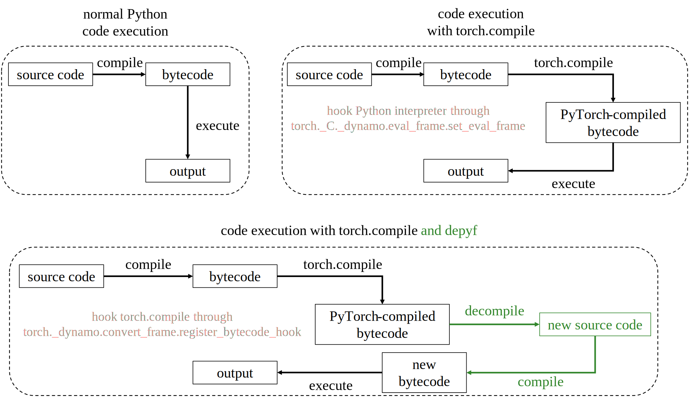

Developer Documentation
===========================================

For developers, if you want to understand and contribute to the codebase, this section is for you.

Overall architecture of the library
-----------------------------------

The figure above shows the overall architecture of the library.

1. Normally, when we execute Python code, the code is compiled into Python bytecode, which is then executed by the Python interpreter.
2. When ``torch.compile`` is used, PyTorch will compile the function into a new bytecode object to execute. It achieves this via registering a frame-evaluation function to the Python interpreter. The frame-evaluation function will be called whenever the function is executed. PyTorch wraps the frame-evaluation callback registration via the ``torch._C._dynamo.eval_frame.set_eval_frame`` function. Because PyTorch directly generates the bytecode, it does not have the source code information. The bytecode is directly executed by the Python interpreter.
3. When ``depyf`` is used together with PyTorch, it will register a bytecode hook to PyTorch via ``torch._dynamo.convert_frame.register_bytecode_hook`` (we work together with the PyTorch team to design this bytecode hook mechanism). The hook will be called whenever PyTorch compiles a function. The hook will decompile the bytecode into source code and dump the source code to disk. The source code is then compiled into a new bytecode object, which is functionally equivalent to the bytecode generated by PyTorch, but with source code information. PyTorch will use the new bytecode object to execute the function. The part related with ``depyf`` is marked as green.

With this, it is clear that the library is a Python bytecode decompiler with tight integration with PyTorch. It naturally falls into 2 parts:

* The decompiler is implemented in the ``depyf/decompiler.py`` file. It can also be used as a standalone library to decompile Python bytecode.
* The PyTorch integration is implemented in the ``depyf/explain/enable_debugging.py`` file. It also contains lots of code to deal with the rest of the PyTorch compiler, such as graph compilation and transformation, code guards and caches, etc.

Relatively speaking, the PyTorch integration part is easier to understand and contribute. Our main goal for the integration is to make ``depyf`` compatible with all previous versions of PyTorch starting from PyTorch 2.2 . To achieve this goal, the test is run against the nightly build of PyTorch. Whenever we find a compatibility issue, we will fix it in a backward-compatible way. If such a fix is not possible, we will discuss with the PyTorch team to find a solution.

The decompiler part is more challenging. It is complicated and needs to deal with all sorts of random Python implementation details. Fortunately, we only need to deal with official release versions of Python, which makes the task more manageable. The decompiler only needs to be updated once we find a bug or a new Python version is released.

If you want to dive deeper into the decompiler part, please go on reading.

Overview of the decompiler
--------------------------

To become comfortable with reading bytecode, it is recommended to read the following materials first:

- `torchdynamo deepdive <https://www.youtube.com/watch?v=egZB5Uxki0I>`_ : This video explains the motivation and design of torchdynamo. In particular, it mentions how Python bytecode acts like a stack machine, which helps to understand how the bytecode is executed.
- `Python bytecode documentation <https://docs.python.org/3/library/dis.html>`_ : This documentation explains the Python bytecode instructions. Note that Python bytecode does not guarentee any backward compatibility, so the bytecode instructions may change for every Python versions. We should consider all the supported Python versions when implementing the decompiler.
- `A Python Interpreter Written in Python <https://aosabook.org/en/500L/a-python-interpreter-written-in-python.html>`_ : This book chapter explains how to write a Python interpreter in Python. It is a good starting point to understand how Python bytecode is executed.

The decompilation process is achieved by executing the Python bytecode and recording the stack and the variables, with the value of the variables represented by their source code.

For example, consider the following simple function:

.. code-block:: python

    def f(a, b):
        return a + b

It has the following bytecode:

.. code-block:: text

    0 LOAD_FAST                0 (a)
    2 LOAD_FAST                1 (b)
    4 BINARY_ADD
    6 RETURN_VALUE

When we execute the first bytecode ``LOAD_FAST``, instead of loading a variable into the stack, we push the variable name ``"a"`` in the stack, which is a string representation of the variable.

When we execute the second bytecode ``LOAD_FAST``, likewise, we push the variable name ``"b"`` in the stack.

When we execute the third bytecode ``BINARY_ADD``, which intends to add the two variables, we pop the two variables from the stack, and perform the string concatenation ``"a + b"``. The concatenated string is pushed back to the stack.

Finally, when we execute the fourth bytecode ``RETURN_VALUE``, we pop the string from the stack, prefix it with the ``return`` keyword, and then we get the decompiled source code ``"return a + b"``.

To accurately decompile the bytecode, we need to faithfully respect the semantics of the Python bytecode instructions. It is noteworthy that the `Python bytecode documentation <https://docs.python.org/3/library/dis.html>`_ can be outdated and inaccurate, too. The golden standard is to refer to the CPython source code and the Python interpreter's behavior. The `torchdynamo source code <https://github.com/pytorch/pytorch/blob/main/torch/_dynamo/symbolic_convert.py>`_ is also a good reference to understand how the Python bytecode is generated by PyTorch.

Should you have any further questions, feel free to ask in the `GitHub Issues <https://github.com/thuml/depyf/issues>`_ section.
