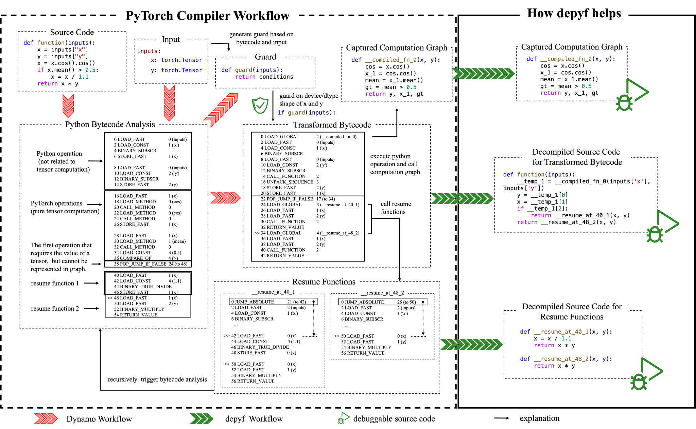

Welcome to the documentation of ``depyf``
==========================================

Before learning the usage of ``depyf``, we recommend reading :doc:`walk_through`, so that you can understand how ``depyf`` would help you.

``depyf`` aims to address two pain points of ``torch.compile``:

- ``torch.compile`` transforms Python bytecode, but very few developers can read Python bytecode (unless you have a stack machine inside your brain ...) to understand what is going on. ``depyf`` helps to decompile the transformed bytecode back into Python source code, so that developers can understand how ``torch.compile`` transforms their code. This greatly helps users to adapt their code to ``torch.compile``, so that they can write code friendly to ``torch.compile``.
- ``torch.compile`` dynamically generate many functions, which can only be run as a black box. Users cannot step through the code line by line. ``depyf`` helps to dump the source code to files, and to link these functions with the source code files, so that users can use debuggers to step through these functions. This greatly helps users to understand ``torch.compile`` and debug issues like ``NaN`` during training.

Take the workflow from the walk-through example:

``depyf`` helps to:

- Give a source code description of the above workflow, so that users can easily understand it. (The actual workflow happens in C and inside the CPython interpreter, we give a Python source code description of the workflow, so that users can easily understand it.)
- Generate source code for transformed bytecode and resume functions.
- Link graph computation functions with on-disk code, so that debuggers can step through the code.

The main usage of ``depyf`` involves two context managers, and it is recommended to launched the script with a debugger:

.. code-block:: python

    import torch

    @torch.compile
    def function(inputs):
        x = inputs["x"]
        y = inputs["y"]
        x = x.cos().cos()
        if x.mean() > 0.5:
            x = x / 1.1
        return x * y

    shape_10_inputs = {"x": torch.randn(10, requires_grad=True), "y": torch.randn(10, requires_grad=True)}
    shape_8_inputs = {"x": torch.randn(8, requires_grad=True), "y": torch.randn(8, requires_grad=True)}

    import depyf
    with depyf.prepare_debug("./debug_dir"):
        # warmup
        for i in range(100):
            output = function(shape_10_inputs)
            output = function(shape_8_inputs)
    # the program will pause here for you to set breakpoints
    # then you can hit breakpoints when running the function
    with depyf.debug():
        output = function(shape_10_inputs)

The first context manager ``depyf.prepare_debug()`` accepts one directory path to dump all source code to. Inside this context manager, all internal details of PyTorch will be hooked by ``depyf``, which dumps necessarry source code for you.

The second context manager ``depyf.debug()`` has no arguments, it just disables new compiled entries. Upon entering the context manager, the program will pause, and you can browse all source code under the directory you specify (``"./debug_dir"`` in this example). The entry file is ``full_code_for_xxx.py``. You can set breakpoints inside these files. And the most important thing is, those breakpoints you set, can be hit under this context manager. And you can step through the code line by line, to debug possible ``NaN`` values or to understand what happens to your code.

The following figure shows two typical usages of ``depyf``, and lists all the generated files.

.. image:: _static/images/usage.svg
  :width: 1200
  :alt: Two typical usages of ``depyf``.

You can also check `the advanced usages <./index.html>`_ and `frequently asked questions <./faq.html>`_ for more details.

If you'd like to contribute (which we highly appreciate), please read the `developer documentation <./dev_doc.html>`_ section.

.. toctree::
   :maxdepth: 1
   :hidden:

   api_reference
   walk_through
   opt_tutorial
   dev_doc
   faq
