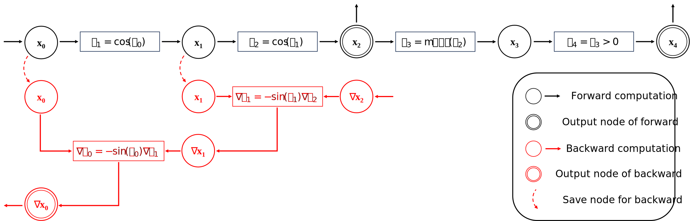
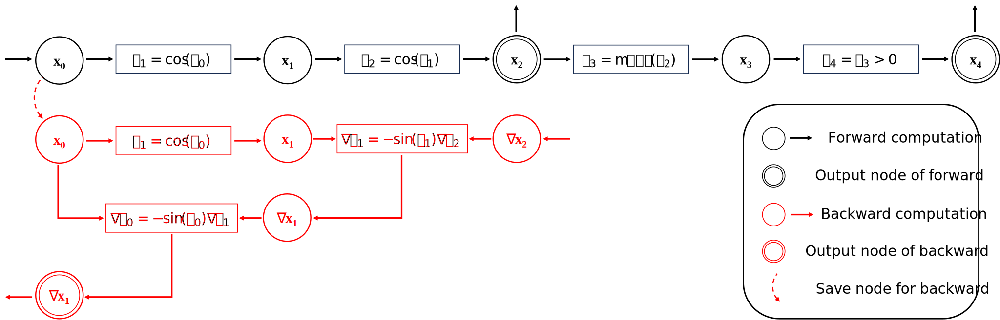

A Walk Through Example of ``torch.compile``
===========================================

In this tutorial, we will learn how does PyTorch compiler work for the following code:

.. code-block:: python

    import torch

    @torch.compile
    def function(inputs):
        x = inputs["x"]
        y = inputs["y"]
        x = x.cos().cos()
        if x.mean() > 0.5:
            x = x / 1.1
        return x * y

    shape_10_inputs = {"x": torch.randn(10, requires_grad=True), "y": torch.randn(10, requires_grad=True)}
    shape_8_inputs = {"x": torch.randn(8, requires_grad=True), "y": torch.randn(8, requires_grad=True)}
    # warmup
    for i in range(100):
        output = function(shape_10_inputs)
        output = function(shape_8_inputs)
    
    # execution of compiled functions
    output = function(shape_10_inputs)

The code tries to implement a strange activation function :math:`\text{cos}(\text{cos}(x))`, and scales the output according to its activation value, then multiplies the output with another tensor ``y``.

The tutorial intends to cover the following aspects of PyTorch compiler:

- Dynamo (graph capture)
- AOTAutograd (forward graph and backward graph)
- Inductor (compile graph to kernel)

PyTorch compiler is a Just-In-Time compiler
--------------------------------------------

The first concept we have to know is that PyTorch compiler is a Just-In-Time compiler. So what does `Just-In-Time compiler` mean? Well, let's look at another example:

.. code-block:: python

    import torch

    class A(torch.nn.Module):
        def __init__(self):
            super().__init__()

        def forward(self, x):
            return torch.exp(2 * x)

    class B(torch.nn.Module):
        def __init__(self):
            super().__init__()

        def forward(self, x):
            return torch.exp(-x)

    def f(x, mod):
        y = mod(x)
        z = torch.log(y)
        return z

We write this funny function ``f``, that contains a module call, and a ``torch.log`` call. Anyone with elementary math knowledge cannot wait to optimize the code as follows:

.. code-block:: python

    def f(x, mod):
        if isinstance(mod, A):
            return 2 * x
        elif isinstance(mod, B):
            return -x

That's it! We can call it our fist Just-In-Time compiler, although it is `compiled` by our brain rather than an automated program.

The basic workflow of a Just-In-Time compiler is: right before the function is executed, it analyzes if the execution can be optimized, and what is the condition under which the function execution can be optimized. Hopefully, the condition is general enough for new inputs, so that the benfit outweights the cost of Just-In-Time compilation.

This leads to two basic concepts in Just-In-Time compilers: guards, and compiled code. Guards are conditions when the functions can be optimized, and compiled code is the optimized version of functions. In the above simple Just-In-Time compiler example, ``isinstance(mod, A)`` is a guard, and ``return 2 * x`` is the corresponding compiled code that is equivalent to the original code under the guarding condition, but is significantly faster.

And if we want to be rigorous, our Just-In-Time example should be updated as follows:

.. code-block:: python

    def f(x, mod):
        if isinstance(x, torch.Tensor) and isinstance(mod, A):
            return 2 * x
        elif isinstance(x, torch.Tensor) and isinstance(mod, B):
            return -x
        else:
            y = mod(x)
            z = torch.log(y)
            return z

We have to check each parameter so that our guards are sound, and also fallback to the original code if we fail to optimize the code.

Going more rigorous, the above example is actually an Ahead-of-time compiler: we inspect all the available source code, and before running any function, we write the optimized function in terms of guards and compiled code. A real Just-In-Time procedure should be:

.. code-block:: python

    def f(x, mod):
        for guard, compiled_code in f.compiled_entries:
            if guard(x, mod):
                return compiled_code(x, mod)
        try:
            guard, compiled_code = compile_and_optimize(x, mod)
            f.compiled_entries.append([guard, compiled_code])
            return compiled_code(x, mod)
        except FailToCompileError:
            y = mod(x)
            z = torch.log(y)
            return z

A Just-In-Time compiler just optimizes for what it has seen. Everytime it sees a new input that does not satisfy any guarding condition, it compiles a new guard and compiled code for the new input.

Let's explain it step-by-step:

.. code-block:: python

    import torch

    class A(torch.nn.Module):
        def __init__(self):
            super().__init__()

        def forward(self, x):
            return torch.exp(2 * x)

    class B(torch.nn.Module):
        def __init__(self):
            super().__init__()

        def forward(self, x):
            return torch.exp(-x)

    @just_in_time_compile
    def f(x, mod):
        y = mod(x)
        z = torch.log(y)
        return z

    a = A()
    b = B()
    x = torch.randn((5, 5, 5))
    # before executing f(x, a), f.compiled_entries == []
    # after executing f(x, a), f.compiled_entries == [Guard("isinstance(x, torch.Tensor) and isinstance(mod, A)"), CompiledCode("return 2 * x")]
    f(x, a)
    # the second call of f(x, a) hit a condition, so we can just execute the compiled code
    f(x, a)
    # f(x, b) will trigger compilation and add a new compiled entry
    # before executing f(x, b), f.compiled_entries == [Guard("isinstance(x, torch.Tensor) and isinstance(mod, A)"), CompiledCode("return 2 * x")]
    # after executing f(x, b), f.compiled_entries == [Guard("isinstance(x, torch.Tensor) and isinstance(mod, A)"), CompiledCode("return 2 * x"), Guard("isinstance(x, torch.Tensor) and isinstance(mod, B)"), CompiledCode("return -x")]
    f(x, b)
    # the second call of f(x, b) hit a condition, so we can just execute the compiled code
    f(x, b)

That's basically how ``torch.compile`` works as a Just-In-Time compiler. We can even extract those compiled entries from functions, see the `PyTorch documentation <https://pytorch.org/docs/main/torch.compiler_deepdive.html#how-to-inspect-artifacts-generated-by-torchdynamo>`_ for more details.

How does Dynamo transform and modify the function?
---------------------------------------------------

As we understand the global picture of ``torch.compile`` as a Just-In-Time compiler, we can diver deeper in how it works. Unlike general purpose compilers like ``gcc`` or ``llvm``, ``torch.compile`` is a domain-specific compiler: it only focuses on PyTorch related computation graph. Therefore, we need a tool to separate users code into two parts: plain python code and computation graph code.

``Dynamo``, living inside the module ``torch._dynamo``, is the tool for doing this. Normally we don't interact with this module directly. It is called inside the ``torch.compile`` function.

Conceptually, ``Dynamo`` does the following things:

- Find the first operation that cannot be represented in computation graph but requires the value of computed value in the graph (e.g. ``print`` a tensor's value, use a tensor's value to decide ``if`` statements control flow in Python).
- Split the previous operations into two parts: a computation graph that is purely about tensor computation, and some Python code about manipulating Python objects.
- Leave the rest operations as one or two new functions (called ``resume functions``), and trigger the above analysis again.

To enable such a fine-grained manipulation of functions, ``Dynamo`` operates on the level of Python bytecode, a level that is lower than Python source code.

The following procedure describes what Dynamo does to our function ``function``.

One important feature of ``Dynamo``, is that it can analyze all the functions called inside the ``function`` function. If a function can be represented entirely in a computation graph, that function call will be inlined and the function call is eliminated.

The mission of ``Dynamo``, is to extract computation graphs from Python code in a safe and sound way. Once we have the computation graphs, we can enter the world of computation graph optimization now.

AOTAutograd: generate backward computation graph from forward graph
------------------------------------------------------------------------

The above code only deals with forward computation graph. One important missing piece is how to get the backward computation graph to compute the gradient.

In plain PyTorch code, backward computation is triggered by the ``backward`` function call on some scalar loss value. Each PyTorch function stores what is required for backward during forward computation.

The following computation graph shows the details:

When we can get the computation graph from ``Dynamo`` before it is executed, we can also get its backward computation graph before any ``backward`` function is called.

For any computation graph represented by a function:

.. code-block:: python

    def forward(inputs):
        return outputs

Its corresponding backward function signature is:

.. code-block:: python

    def backward(outputs_grad):
        return inputs_grad

And their joint computation graph is:

.. code-block:: python

    def joint_forward_and_backward(inputs, outputs_grad):
        return outputs, inputs_grad

For someone who is familiar with automatic differentiation, this is the ``vjp`` function (vector-jacobian product). For the rest who don't understand the terminology, please just ignore this paragraph.

When we have the joint computation graph ahead-of-time (i.e. before calling any ``backward`` on some loss value), we have some control over what can be saved:

.. code-block:: python

    def partitioned_joint_graph(inputs, outputs_grad):
        outputs, saved_values = modified_forward(inputs)
        inputs_grad = modified_backward(saved_values, outputs_grad)
        return outputs, inputs_grad

In eager mode, from the computation graph above, we can observe that ``saved_values`` are xxx and xxx. Can we do better to save less values so that we can save memory footprint?

Here is the answer from AOTAutograd:

We can only save one value, and recompute the first ``cos`` function to get another value for backward. That is basically how AOT Autograd works!

Backend: compile and optimize computation graph 
--------------------------------------------------

Finally, after ``Dynamo`` separates PyTorch code from Python code, and after ``AOTAutograd`` generates the backward computation graph from the forward computation graph, we entered the world of pure computation graphs.

This is how the ``backend`` argument in ``torch.compile`` comes into play. It takes the above computation graphs as input, and generates optimized code that can execute the above computation graphs.

In general, a backend will try every optimize techniques it knows for the computation graphs. Each optimization technique is called one ``pass``. Some optimization passes from the PyTorch builtin backend, namely the ``Inductor`` backend, can be found `here <https://github.com/pytorch/pytorch/tree/main/torch/_inductor/fx_passes>`_.

In addition, no optimization is also a possible optimization. This is called ``eager`` backend in PyTorch.

Summary
--------------------------------------------------

.. list-table:: Summary of backends
   :header-rows: 1

   * - backend
     - forward computation graph
     - backward computation graph
     - computation graph optimization
   * - ``eager``
     - captured by ``Dynamo``
     - N/A
     - N/A
   * - ``aot_eager``
     - captured by ``Dynamo``
     - generated by ``AOTAutograd``
     - N/A
   * - ``inductor``
     - captured by ``Dynamo``
     - generated by ``AOTAutograd``
     - optimized by ``Inductor``
   * - ``...`` (many other backend options)
     - captured by ``Dynamo``
     - generated by ``AOTAutograd``
     - optimized by custom implementations

In a strict sense, the ``backend`` option in ``torch.compile`` affects whether backward computation graph exists and how the computation graphs are optimized. In practice, custom backends usually work with ``AOTAutograd`` to obtain backward computation graphs, and they only need to deal with computation graph optimization, no matter it is forward graph or backward graph.